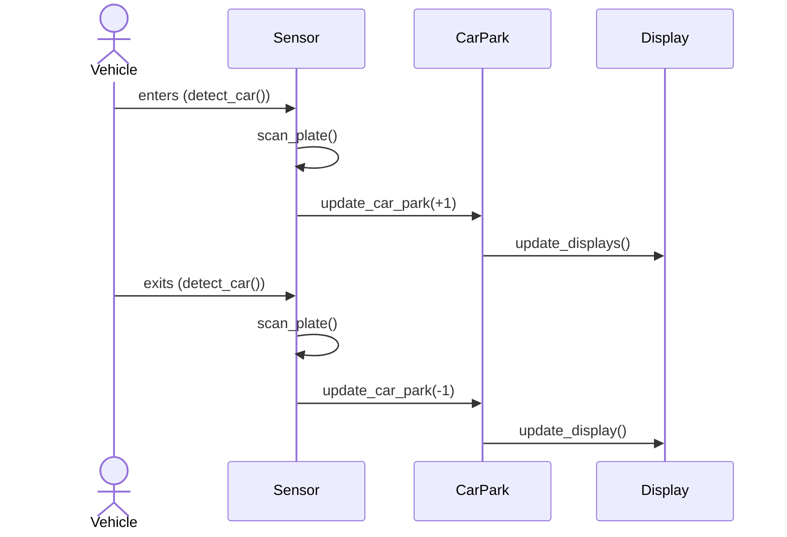
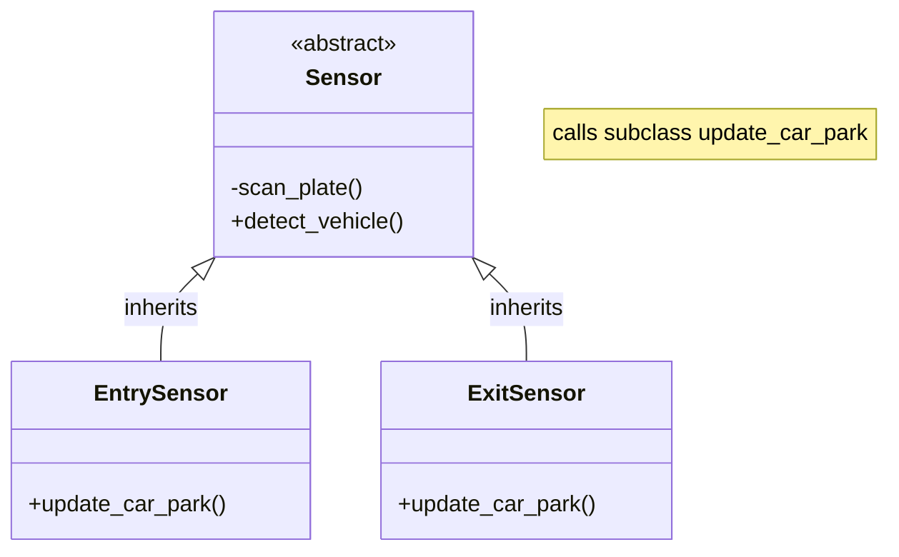
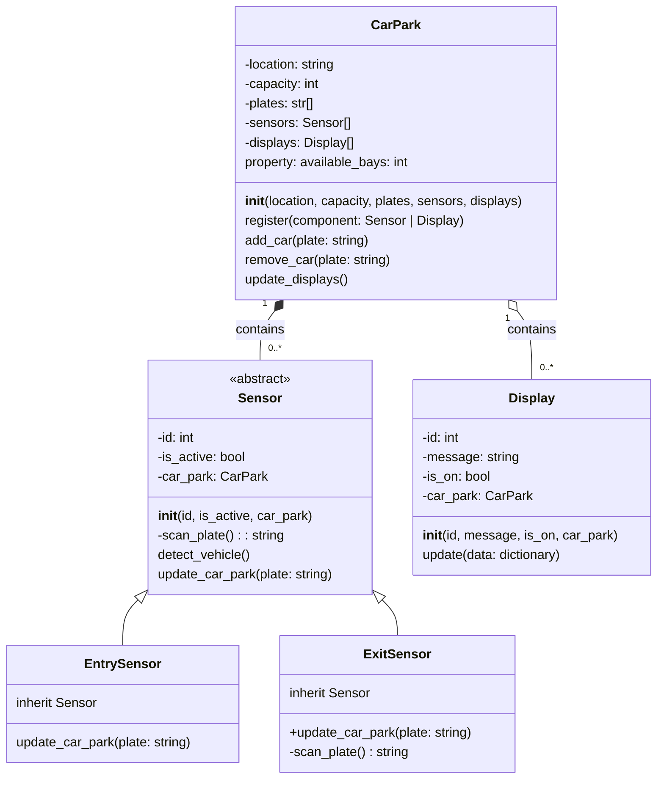

# Object-Oriented Programming - Car Park System
>
> Assessment Guide: a step-by-step worksheet you can use to complete all the project's coding and version control requirements.

## Overview

In this assessment, you must design and implement a simplified car park system using Object-Oriented Programming (OOP) concepts in Python. The system will consist of a **car park**, **sensors**, and **displays** to track the cars entering and exiting and the availability of parking bays.

The system will be implemented in Python using the PyCharm IDE. You will use version control to manage your project and submit your work.

This guide provides detailed step-by-step instructions for completing the project. You do **not** have to use this guide, but it will make your life easier and ensure you meet **all** project requirements. If you choose not to follow the guide, read the submissions requirements carefully to ensure you meet all the requirements.

## Instructions

### Set up version control

1. Create a new repository on GitHub. Initialize it with a `README.md`, .`gitignore`, and optionally a license.
2. Clone the repository to your local machine.
3. Update the `README.md` file with a brief project description.
4. Modify the `.gitignore` file to exclude the `.idea/` folder. Pycharm creates this folder and contains project-specific settings that should not be shared.
5. Create a virtual environment for your project. This will allow you to install packages without affecting other projects on your machine.

   ```bash
   python -m venv venv
   
   # On Windows cmd:
   venv\Scripts\activate.bat
   
   # On Git Bash:
   source venv/Scripts/activate
   
   # On any other OS:
   source venv/bin/activate
   ```

6. Open the project folder in Pycharm. Pycharm will detect the virtual environment and use it for the project.
7. Create a `src` and `tests` directories in your project. The `src` directory will contain your Python scripts, and the `tests` directory will contain your unit tests. Your project structure should look like this:

   ```bash
   ipriot-car_park-prj/  # >> This is your project root folder
   ├── .idea/
   ├── .git/
   ├── venv/
   ├── .gitignore
   ├── README.md
   ├── src/
   └── tests/
   ```

8. Create a new Python file in the `src` directory called `main.py`. This will be the main script for your car park system.
9. Create a new Python file in the `tests` directory called `test_car_park.py`. This will be the main script for your unit tests.
10. In PyCharm, mark the `src` directory as a source root. This will allow you to import modules from the `src` directory in your unit tests; keep the `tests` directory as a test root. This will enable you to run your unit tests from the IDE.
11. Commit your changes to the repository, both locally and remotely:

      ```bash
      git add .
      git commit -m "Initial commit"
      git push
      ```

**Evidencing:**
Include a screenshot of your GitHub repository **after** you have pushed your initial commit.

```text

```

### Identify classes, methods, and attributes

After reading the task requirements, you should be able to identify the classes, methods, and attributes required for the car park system. Complete the following table with the classes, methods, and attributes you must implement.

| Class Name | Attributes | Methods |
| ---------- | ---------- | ------- |
| `CarPark`    |            |         |
| `Sensor`     |            |         |
| `Display`    |            |         |
| `Config`     |            |         |

**Evidencing:**
Ensure you have completed the previous table and include at least two methods and attributes for each.

### Implement stubs for the classes

1. In your `src/` directory, create a new Python file for each class you identified in the previous step. For example, `car_park.py`, `sensor.py`, `display.py`, and `config.py`.
   Notice that the file names are all lowercase and use underscores to separate words. This is a common convention for Python file names.
2. In each file, create a class with the same name as the file. For example, the `car_park.py` file should contain a `CarPark` class. Notice that the class name is capitalized and uses CamelCase to separate words. This is a common convention for Python class names. An example class definition is shown below:

   ```python
   class CarPark:
       pass
   ```

3. Commit your changes to the repository, both locally and remotely:

      ```bash
      git add .
      git commit -m "Added stubs for classes"
      git push
      ```

**Evidencing:**
Include a screenshot of your GitHub repository `src/` directory **after** you have pushed your changes.

```text

```

### Add constructors and attributes to the classes

#### CarPark class

1. Create an `__init__` method for the `CarPark` class. This method will be called when a new `CarPark` object is created. The method should accept the following parameters:
   - `location`
   - `capacity`
   - `plates`
   - `sensors`
   - `displays`
2. Add instance variables for each of the parameters. For example, `self.location = location`.
3. Add a default value for each parameter. For example, `location = "Unknown"`.
4. Notice that sensors and displays are lists ("s"). This is because a car park can have multiple sensors and displays. Add an empty list for each of these parameters. For example, `self.sensors = []`. However, lists are mutable, and we must never set mutable defaults for parameters. So make the defaults `None`.
5. Add a `__str__` method to the `CarPark` class. This method will be called when you print a `Car park` object. The method should return a string containing the car park's location and capacity. For example, `"Car park at 123 Example Street, with 100 bays."`.
6. Your car park class should now look similar to this:

   ```python
   class CarPark:
      def __init__(self, location="Unknown", capacity=0, plates=None, sensors=None, displays=None):
         self.location = location
         self.sensors = sensors or [] # uses the first value if not None, otherwise uses the second value
         ... # Add the other parameters here
      
      def __str__(self):
         ... # Return a string containing the car park's location and capacity
   ```

7. Commit your changes to the repository locally and add a tag so your lecturer can find it. A tag is a way to mark a specific commit as important. You can use tags to mark milestones in your project, often marking releases. You will use it to mark specific commits for your lecturer to review.

   ```bash
   git add .
   git commit -m "Added constructors and attributes to the car park class"
   git tag -a "s1" -m "Added a constructor and attributes to the car park class"
   ```

#### Display class

1. Create an `__init__` method for the `Display` class. This method will be called when creating a new `Display` object. The method should accept the following parameters:
   - `id`
   - `message`
   - `is_on`
   - `car_park`
2. Add instance variables for each of the parameters. For example, `self.id = id`.
3. Add default values for parameters, such that there is no default for id or car park, but there is a default for message and status. For example, `message = ""` and `is_on = False`.
4. Create a `__str__` method for the `Display` class. This method will be called when you print a `Display` object. The method should return a string containing the display's id and message. For example, `"Display 1: Welcome to the car park."`.

#### Sensor class

1. Create an `__init__` method for the `Sensor` class. This method will be called when a new `Sensor` object is created. The method should accept the following parameters:
   - `id`
   - `is_active`
   - `car_park`

   You realize that you need to distinguish between entry and exit sensors. Since each of those sensors will need different methods, you decide to subclass the `Sensor` class.

2. Create a new class called `EntrySensor` that inherits from `Sensor`. The `EntrySensor` class should **not** have an `__init__` method.
Do the same for the `ExitSensor` class.

   Your `sensor.py` file should now look similar to this:

   ```python
   class Sensor:
      def __init__(self, id ...): # Add the other parameters
         self.id = id
         self.is_active = is_active
         ... # Add the other attributes

      def __str__(self):
         ... # Return a string containing the sensor's id and status

   class EntrySensor(Sensor):
      ...

   # Also create an ExitSensor class
   ```

3. Commit your changes to the local repository and add a tag so your lecturer can find it:

   ```bash
   git add .
   git commit -m "Added constructors and attributes to the display and sensor classes"
   git tag -a "s2" -m "Added constructors and attributes to the display and sensor classes"
   ```

4. Now push your **tagged** changes to the remote repository:

   ```bash
   git push --tags
   ```

#### Config class

You realize that you need a way to configure the car park system. You decide to create a `Config` class to store the configuration data. However, you want to have a firmer grasp of the requirements before you implement the class. So you skip this step for now.

--------
**Evidencing:**
Ensure that you have completed the previous steps and created the appropriate tags. Confirm that the tags have been created by running `git tag` in the terminal and provide a screenshot of the output.

```text
[student@workstation ipriot-car-park-prj]$ git tag
s1
s2
```

### Relate the classes

Let's consider how the classes relate to each other. We can start by using a sequence diagram to illustrate the interactions between the classes. A sequence diagram shows the interactions between objects in a sequential order. The following diagram shows the interactions between the `CarPark`, `Sensor`, and `Display` classes.



Notice a sensor detects cars and notifies a car park. The car park then updates the displays. Sensors connect **to** a car park, and a car park connects **to** displays.

In other words, a sensor needs to know about a car park, and a car park needs to know about displays. This is an example of aggregation, where one object holds a reference to another object. In this case, the `CarPark` class holds a reference to instances of the `Display` classes (aggregation); sensors for their part hold a reference to a car park.

The following class diagram presents this relationship:


The diagram omits methods and attributes irrelevant to the relationship between the classes. Notice that the `CarPark` class has a `register` method that allows it to register sensors and displays.

Notice also that displays and sensors reference a car park and a car park references displays. This kind of two-way relationship is not always advisable. But for this project, it is acceptable.

### Implement methods for the CarPark class

Our analysis shows that the car park will need to implement the following methods:

- `register`: This method will allow the car park to register sensors and displays.
- `add_car`: This method will be called when a car enters the car park. It will record the plate number and update the displays.
- `remove_car`: This method will be called when a car exits the car park. It will remove the plate number and update the displays.
- `update_displays`: This method will be called when the car park needs to update the displays. It will iterate through the displays and call their `update` method.

As we implement these methods, we may find we need additional methods and attributes. For example, we may need a method to check if a plate number is already in the car park. We may also need an attribute to store the plate numbers. We can add these as we go.

We will focus on these key principles to guide the need for additional methods and attributes:

- **Encapsulation**: We want to hide the implementation details of the class from other classes. We can do this by making attributes private and only exposing them through methods.
- **Single Responsibility**: We want each method to have a single responsibility. This will make the code easier to understand and maintain.
- **DRY**: We want to avoid repeating code or information about the state (Don't Repeat Yourself). We can do this by creating methods and attributes for behaviours and values that are repeated.

---

#### Register method

1. Create a `register` method for the `CarPark` class. This method should accept a single parameter, `component`. This parameter will be either a `Sensor` or `Display` object.
2. If the `component` is a `Sensor`, add it to the `sensors`. If the `component` is a `Display`, add it to the `displays` list.
3. If the `component` is neither a `Sensor` nor a `Display`, raise a `TypeError` with the message `"Object must be a Sensor or Display"`.

**Stuck?**
Here are some some hints to help you complete this task:

Even though we often think of exceptions last, we generally want to put them first in our method definitions. This is because exceptions are exceptional. We want to handle them first and then handle the normal flow of the method. This is called a **guard pattern** and is a common pattern in Python and other languages.
Let's do that now. Add the following code to the top of the `register` method:

   ```python
   # ... inside the CarPark class
   def register(self, component):
      if not isinstance(component, (Sensor, Display)):
         raise TypeError("Object must be a Sensor or Display")
   ```

The `isinstance` function checks if an object is an instance of a class. In this case, we check if the `component` is an instance of either the `Sensor` or `Display` class. Notice that we'll need to import the `Sensor` and `Display` classes to use them in the `isinstance` function. Add the following import statement to the top of the `car_park.py` file:

   ```python
   from sensor import Sensor
   from display import Display
   ```

Now we can add the code to add the `component` to the appropriate. Add the following code to the `register` method:

   ```python
   # ... inside the register method
   if isinstance(component, Sensor):
      self.sensors.append(component)
   # add an elif to check if the component is a Display
   ```

**Evidencing:**
After you have implemented the required code, commit your changes to the local repository and add a tag so your lecturer can find it:

   ```bash
   git add .
   git commit -m "Added a register method to the car park class"
   git tag -a "s3" -m "Added a register method to the car park class"
   ```

#### Add and remove car methods

When a car enters the car park, we record its plate number and update the displays. When a car exits the car park, we remove its plate number and update the displays. We can implement these behaviours in the `add_car` and `remove_car` methods.

1. In the CarPark class, create an `add_car` method. This method should accept a single parameter, `plate`. This parameter will be a string containing the car's plate number.
2. Append the `plate` to the `plates` list (`self.plates.append(plate)`).
3. Call the `update_displays` method.
   Hang on, we haven't implemented the `update_displays` method yet. We'll do that next.
   Here is a sample implementation of the `add_car` method:

      ```python
      # ... inside the CarPark class
      def add_car(self, plate):
         self.plates.append(plate)
         self.update_displays()
      ```

4. Repeat the previous steps to implement the `remove_car` method. This method also accepts a single parameter, `plate` and also calls `update_displays`. However, this method should remove the plate from `self.plates`.

#### Update displays method

Finally, we are going to create the `update_displays` method. This method will iterate through the `displays` list and call the `update` method on each display. Before we proceed, consider, as a driver, what information you would like to see when you enter a car park.

You may want to see the number of available bays, the current temperature, and the time.

Now consider, between the `CarPark`, `Sensor`, and `Display` classes, which class is responsible for each of these pieces of information? There's no right or wrong answer here. But you should be able to justify your answer.

Q. Which class is responsible for the number of available bays (and why)?
Q. Which class is responsible for the current temperature (and why)?
Q. Which class is responsible for the time (and why)?

--------

##### Detour: implement available bays

You realize that you are not currently maintaining the number of available bays. The number of available bays is a curious case. This value, on the one hand, clearly seems like an attribute of the car park. However, it is also a **property** of the car park's capacity and the number of cars in the car park. In other words, it is a **derived** value. We can calculate the number of available bays by subtracting the number of cars from the capacity. We can do this in the `CarPark` class by adding a `get_available_bays` method. This method will return the number of available bays.

But you're uncomfortable with this because even though you derive the value through a calculation it still seems like an attribute. Python has a built-in way to treat a method as though it is a simple attribute. We can use it to protect values as well as make attributes derived via simple calculations easier to access. Fittingly, it is called a **property**. We can create a property by adding a `@property` decorator (we'll learn more about decorators in the diploma) to a method. While we don't yet fully understand decorators, the important thing is that they make a method act like an attribute.

Let's add `available_bays` as a property now:

```python
      # ... inside the CarPark class
      @property
      def available_bays(self):
         return self.capacity - len(self.plates)
```

Notice that we did **not** use a verb in a property name. This is because properties are accessed like attributes. For example, `car_park.available_bays` instead of `car_park.get_available_bays()`.

An added bonus is that if someone accidentally tries to set the value to this property, they will get an error. This is because we have not defined a property setter, and this is a good thing in this case.

You recognize an issue: what if the number of cars that entered exceeds capacity?

We might not be able to stop this from happening!

But what should happen if it does? Do we want to allow the number of available bays to be negative? Or should we set it to zero? Or should we raise an exception? Something else??

You discuss with the senior developer and decide that if the number of plates exceeds the capacity you will return 0.

> Modify the `available_bays` property to return 0 if the number of plates exceeds the capacity.

--------

#### Back to the update displays method

The `update_displays` method shall send status information: available bays, temperature, and any other relevant information to each display. We will implement this method in the `CarPark` class.

1. Create an `update_displays` method in the `CarPark` class. This method only needs to accept the `self` parameter.
2. Build a dictionary containing the information you want to send to the displays. For example, `data = {"available_bays": self.available_bays, "temperature": 25}`.
3. Iterate through the `displays` list and call the `update` method on each display. For example, `for display in self.displays: display.update(data)`.
4. Create a `update` method for the `Display` class. This method should accept a single parameter, `data`. For now, we will simply print the keys and values. Here is a sample implementation:

   ```python
   # ... inside the Display class
   def update(self, data):
      for key, value in data.items():
         print(f"{key}: {value}")
   ```

**Evidencing:**
After you have implemented the required code, commit your changes to the local repository and add a tag so your lecturer can find it:

   ```bash
   git add .
   git commit -m "Added methods to the car park class"
   git tag -a "s4" -m "Added methods to the car park class"
   ```

This time, we will push the tag to the remote repository:

   ```bash
   git push --tags
   ```

Add a screenshot of the GitHub repository after pushing the tag, showing the CarPark class with the new methods:

```text

```

Answer the following questions:

```text
   1. Which class is responsible for each of the following pieces of information (and why)?
      - The number of available bays
      - The current temperature
      - The time
   2. What is the difference between an attribute and a property?
   3. Why do you think we used a dictionary to hold the data we passed the display? List at least one advantage and one disadvantage of this approach
```

#### Add a detect vehicle method to the Sensor class

A sensor detects a vehicle, scans the plate, and notifies the car park. The Sensor class is specialized by the EntrySensor and ExitSensor classes. We will implement the `detect_vehicle` method in the `EntrySensor` and `ExitSensor` classes.

The Sensor superclass is abstract, meaning we don't expect it to be instantiated. However, we can still implement methods in the superclass. We will implement the `detect_vehicle` method in the `Sensor` class. The `detect_vehicle` method will be called when a vehicle is detected. It will scan the plate and call the `update_car-park` method.

The `update_car_park` method should be implemented in the `EntrySensor` and `ExitSensor` classes. This method will be called by the `detect_vehicle` method. Since the implementation will be determined by the subclass, this is an example of polymorphism.



1. Open `sensor.py`, and add the following import statement to the top of the file:

   ```python
   from car_park import CarPark
   from abc import ABC, abstractmethod
   ```

2. Update the class declaration to inherit from ABC: `class Sensor(ABC):`.
3. Add an `update_car_park` method to the `Sensor` class. This method should accept a single parameter, `plate`. This method should be abstract, meaning it should not be implemented in the superclass and must be implemented by a subclass. We can do this by adding the `@abstractmethod` decorator to the method. Here is a sample implementation:

   ```python
   # ... inside the Sensor class
   @abstractmethod
   def update_car_park(self, plate):
      pass
   ```

4. Create a private method called `scan_plate`. The method should return a plate. For now, we will simply return a random plate. Here is a sample implementation:

   ```python
   # ... inside the Sensor class
   def _scan_plate(self):
      return 'FAKE-' + format(random.randint(0, 999), "03d")
   ```

5. Create a `detect_vehicle` method **in the Sensor class**. The method includes the following steps:
   - Call the `scan_plate` method to get the plate.
   - Call the `update_car_park` method with the plate.
   Notice that the `update_car_park` method is abstract. It is **not** implemented in the `Sensor` class. This is because the implementation will be determined by the subclass.
   Here is a proposed implementation:

   ```python
      # ... inside the Sensor class
   def detect_vehicle(self):
      plate = self._scan_plate()
      self.update_car_park(plate)
   ```

6. Now, let's implement update_car_park in the EntrySensor class. This method should accept a single parameter, `plate`. Here is a sample implementation:

   ```python
   # ... inside the EntrySensor class
   def update_car_park(self, plate):
      self.car_park.add_car(plate)
      print(f"Incoming 🚘 vehicle detected. Plate: {plate}")
   ```

7. Let's do the same for the ExitSensor:

   ```python
   # ... inside the ExitSensor class
   def update_car_park(self, plate):
      self.car_park.remove_car(plate)
      print(f"Outgoing 🚗 vehicle detected. Plate: {plate}")
   ```

Normally, we'd be done. But the astute among you may have identified a problem: we can generate a random license plate for cars entering, but not cars that are exiting. Remember this is not a real-world problem, just a problem caused by us not having a "real" plate sensor.

So just for this simulation, we will override the _scan_plate method to return a plate at random from the car park. This is a bit of a hack, but it will work for our purposes.

```python
# ... inside the ExitSensor class
def _scan_plate(self):
   return random.choice(self.car_park.plates)
```

**Evidencing:**
After you have implemented the required code, commit your changes to the local repository and add a tag so your lecturer can find it:

   ```bash
   git add .
   git commit -m "Created core methods for the classes"
   git tag -a "s5" -m "Core methods completed"
   ```

Probably a good idea to commit to GitHub now:

   ```bash
   git push --tags
   ```

### Taking stock

Let's take stock of what we've done up till now. Diagrammatically, here is a representation of all the classes, methods, and attributes we have implemented so far in the project:



Take a moment to review the diagram and ensure you have implemented the classes, methods, and attributes correctly. You're about to find out if you haven't!

### Implement unit tests

The first set of unit tests are given to you below. We use the unittest module to create unit tests. The unittest module provides a base class, TestCase, which we can use to create test cases. We can then use the assert methods to test the behaviour of our classes.

#### CarPark unit tests

The following unit tests test the `CarPark` class. They test the `__init__` method, the `add_car` method, and the `remove_car` method. Notice that we use the `setUp` method to create a `CarPark` object before each test. This ensures that each test starts with a fresh `CarPark` object.

```python
import unittest
from car_park import CarPark

class TestCarPark(unittest.TestCase):
      def setUp(self):
         self.car_park = CarPark("123 Example Street", 100)
   
      def test_car_park_initialized_with_all_attributes(self):
         self.assertIsInstance(self.car_park, CarPark)
         self.assertEqual(self.car_park.location, "123 Example Street")
         self.assertEqual(self.car_park.capacity, 100)
         self.assertEqual(self.car_park.plates, [])
         self.assertEqual(self.car_park.sensors, [])
         self.assertEqual(self.car_park.displays, [])
         self.assertEqual(self.car_park.available_bays, 100)
   
      def test_add_car(self):
         self.car_park.add_car("FAKE-001")
         self.assertEqual(self.car_park.plates, ["FAKE-001"])
         self.assertEqual(self.car_park.available_bays, 99)
   
      def test_remove_car(self):
         self.car_park.add_car("FAKE-001")
         self.car_park.remove_car("FAKE-001")
         self.assertEqual(self.car_park.plates, [])
         self.assertEqual(self.car_park.available_bays, 100)

      def test_overfill_the_car_park(self):
         for i in range(100):
            self.car_park.add_car(f"FAKE-{i}")
         self.assertEqual(self.car_park.available_bays, 0)
         self.car_park.add_car("FAKE-100")
         # Overfilling the car park should not change the number of available bays
         self.assertEqual(self.car_park.available_bays, 0)

         # Removing a car from an overfilled car park should not change the number of available bays   
         self.car_park.remove_car("FAKE-100")
         self.assertEqual(self.car_park.available_bays, 0)

      def test_removing_a_car_that_does_not_exist(self):
         with self.assertRaises(ValueError):
            self.car_park.remove_car("NO-1")
         

if __name__ == "__main__":
   unittest.main()

```

1. Create or open the Python file in the `tests` directory called `test_car_park.py` and paste the contents of the previous unit test into it.
2. Commit your changes to the local repository. Do not tag the commit. It is an interim commit.

   ```bash
   git add .
   git commit -m "Added unit tests for the car park class"
   ```

3. Run the above unit tests in PyCharm.
4. Fix any errors you encounter.

**Evidencing:**

1. Add a screenshot of the output of the unit tests. If any failed, add a screenshot of the error message and a screenshot after you have fixed the errors:

   ```text
   
   ```

2. Commit your changes to the local repository. Tag the commit with `s6` so your lecturer can find it:
3. Push the tag to the remote repository:

   ```bash
   git push --tags
   ```

--------
TO BE CONTINUED...

