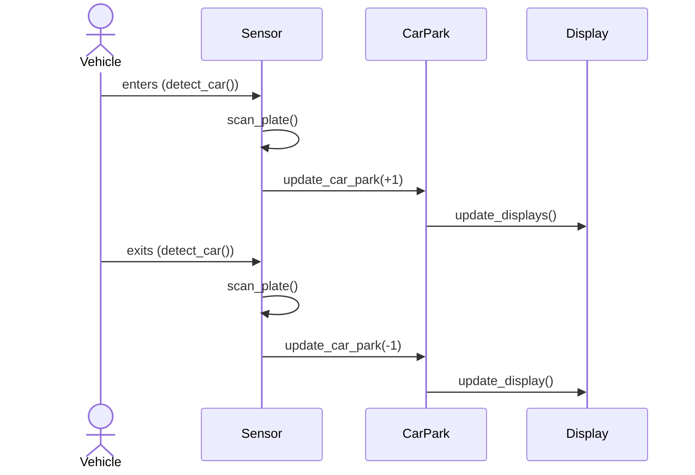
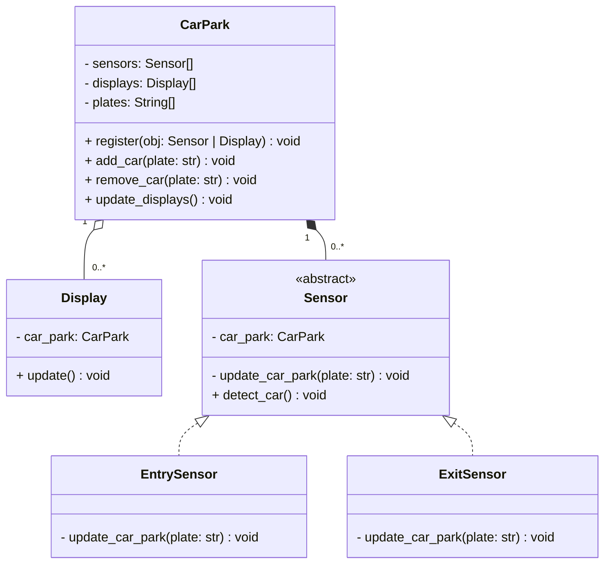
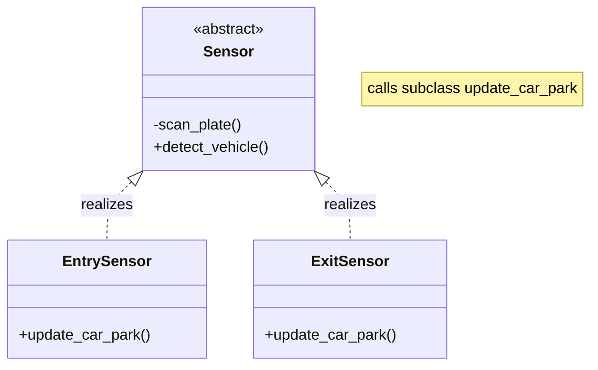
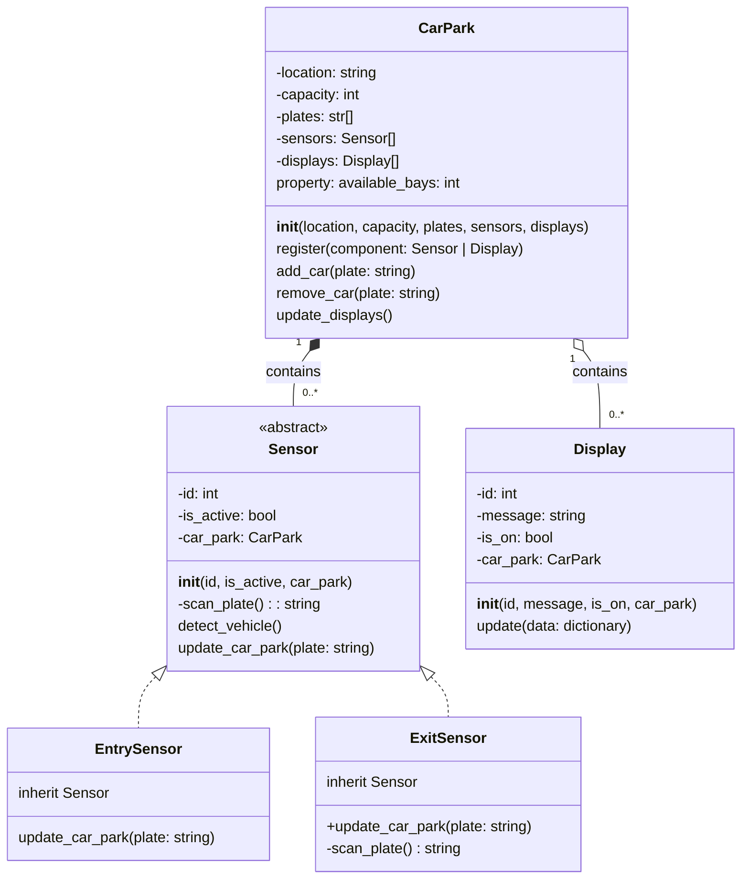

# Object-Oriented Programming - Car Park System

> **Assessment Guide:**
> A step-by-step worksheet you can use to complete all the project's coding and version control requirements. Please raise any issues you identify with the guide [here](https://github.com/NM-TAFE/civ-ipriot-in-class-demos/issues) using the tag `project-guide`.


## Overview

In this assessment, you must design and implement a simplified car park system using Object-Oriented Programming (OOP) concepts in Python. The system will consist of a **car park**, **sensors**, and **displays** to track the cars entering and exiting and the availability of parking bays.

The system will be implemented in Python using the PyCharm IDE. You will use version control to manage your project and submit your work.

This guide provides detailed step-by-step instructions for completing the project. You do **not** have to use this guide, but it will make your life easier and ensure you meet **all** project requirements. If you choose not to follow the guide, read the submission requirements *carefully* (from your Blackboard **Assessments** tab) to ensure you meet all requirements.

## Instructions

### Set up version control
> Note: You must follow the [NMS Git Onboarding Guide](https://github.com/NM-TAFE/ipriot-nms-org-template/blob/main/org/git-onboarding-guide.md)

1. Create a new repository on GitHub. Initialize it with a `README.md`, .`gitignore`, this project guide, and optionally a license.
2. Clone the repository to your local machine.
3. Update the `README.md` file with a brief project description.
4. Modify the `.gitignore` file to exclude the `.idea/` folder. Pycharm creates this folder containing project-specific settings that should not be shared.
5. Create a virtual environment for your project. This will allow you to install packages without affecting other projects on your machine.

   ```bash
   python -m venv .venv

   # On Windows cmd:
   .\.venv\Scripts\activate.bat

   # On Git Bash:
   source .venv/Scripts/activate

   # On any other OS:
   source .venv/bin/activate
   ```

6. Open the project folder in Pycharm. Pycharm will detect the virtual environment and use it for the project.
7. Create a `src` and `tests` directories in your project. The `src` directory will contain your Python scripts, and the `tests` directory will contain your unit tests. Your project structure should look like this:

   ```bash
   ipriot-car_park-prj/  # >> This is your project root folder
   ├── .idea/
   ├── .git/
   ├── venv/
   ├── .gitignore
   ├── README.md
   ├── src/
   └── tests/
   ```

8. Create a new Python file in the `src` directory called `main.py`. This will be the main script for your car park system.
9. Create a new Python file in the `tests` directory called `test_car_park.py`. This will be the main script for your unit tests.
10. In PyCharm, mark the `src` directory as a source root. This will allow you to import modules from the `src` directory in your unit tests; mark the `tests` directory as a test root. This will enable you to run your unit tests from the IDE, without having to mess around with relative imports (long story!).
11. Commit your changes to the repository, both locally and remotely:

      ```bash
      git add .
      git commit -m "Initial commit"
      git push
      ```

**Additional evidencing:**
Include a screenshot of your GitHub repository **after** you have pushed your initial commit.

```markdown

```

### Identify classes, methods, and attributes

After reading the task requirements, you should be able to identify the classes, methods, and attributes required for the car park system. Complete the following table with the classes, methods, and attributes you must implement.

| Class Name | Attributes | Methods |
| ---------- | ---------- | ------- |
| `CarPark`    |            |         |
| `Sensor`     |            |         |
| `Display`    |            |         |

**Additional evidencing:**
Ensure you have completed the previous table and include at least two methods and attributes for each.

### Implement stubs for the classes

1. In your `src/` directory, create a new Python file for each class you identified in the previous step. For example, `car_park.py`, `sensor.py`, and `display.py`.
   Notice that the file names are all lowercase and use underscores to separate words. This is a common convention for Python file names. In general, Python files are named like variables, using lowercase and underscores to separate words.
2. In _each_ file, create a class with the same name as the file. For example, the `car_park.py` file should contain a `CarPark` class. Notice that the class name is capitalized and uses PascalCase to separate words. This is a common convention for Python class names. An example class definition is shown below:

   ```python
   class CarPark:
       pass # this just means nothing... it actually does nothing
   # do this for ALL the other classes!
   ```

3. Commit your changes to the repository, both locally and remotely:

      ```bash
      git add .
      git commit <<appropriate commit message>>
      git push
      ```

**Additional evidencing:**
Include a screenshot of your GitHub repository `src/` directory **after** you have pushed your changes.

```markdown

```

### Add constructors and attributes to the classes

#### CarPark class

1. Create an `__init__` method for the `CarPark` class. This method will be called when a new `CarPark` object is created. The method should accept the following parameters:
   - `location`
   - `capacity`
   - `plates`
   - `sensors`
   - `displays`
2. Add instance variables for each of the parameters. For example, `self.location = location`.
3. Add a default value for each parameter. For example, `location = "Unknown"`.
4. Notice that plates, sensors, and displays are lists ("plurals"). Sensors/Displays, hold references to instances of sensors/displays. The `plates` attribute holds references to license plates represented as strings (built-in/primitive types). Specifying these at initialization is optional, but we don't want to use an empty list as the default. For example, `self.sensors = []`. Lists are **mutable**, and we must never set mutable defaults for parameters. Thus we make the defaults `None`.
5. Add a `__str__` method to the `CarPark` class. When you print a `Car park` object, this method will be called. The method should return a string containing the car park's location and capacity. For example, `"Car park at 123 Example Street, with 100 bays."`.
6. Your car park class should now look similar to this:

   ```python
   class CarPark:
      def __init__(self, location, capacity, plates=None, sensors=None, displays=None):
         self.location = location
         self.sensors = sensors or [] # uses the first value if not None, otherwise uses the second value
         ... # Add the other parameters here

      def __str__(self):
         ... # Return a string containing the car park's location and capacity
   ```

7. Commit your changes to the repository locally and add a tag so your lecturer can find it. A tag is a way to mark a specific commit as important. You can use tags to mark milestones in your project, often marking releases. You will use it to mark specific commits for your lecturer to review.

   ```bash
   git add .
   git commit <<appropriate commit message>>
   git tag -a "s1" -m "Added a constructor and attributes to the car park class"
   ```

#### Display class

1. Create an `__init__` method for the `Display` class. This method will be called when creating a new `Display` object. The method should accept the following parameters:
   - `id`
   - `message`
   - `is_on`
   - `car_park`
2. Add instance variables for each of the parameters. For example, `self.id = id`.
3. Add default values for parameters, such that there is no default for id or car park, but there is a default for message and status. For example, `message = ""` and `is_on = False`.
4. Create a `__str__` method for the `Display` class. This method will be called when you print a `Display` object. The method should return a string containing the display's ID and message. For example, `"Display 1: Welcome to the car park."`.

#### Sensor class

1. Create an `__init__` method for the `Sensor` class. This method will be called when a new `Sensor` object is created. The method should accept the following parameters:
   - `id`
   - `is_active`
   - `car_park`

   You realize that you need to distinguish between entry and exit sensors. Since each of those sensors will need different methods, you decide to subclass the `Sensor` class.

2. Create a new class called `EntrySensor` that inherits from `Sensor`. The `EntrySensor` class should **not** have an `__init__` method.
Do the same for the `ExitSensor` class.

   Your `sensor.py` file should now look similar to this:

   ```python
   class Sensor:
      def __init__(self, id ...): # Add the other parameters
         self.id = id
         self.is_active = is_active
         ... # Add the other attributes

      def __str__(self):
         ... # Return a string containing the sensor's id and status

   class EntrySensor(Sensor):
      ...

   # Also create an ExitSensor class
   ```

3. Commit your changes to the local repository and add a tag so your lecturer can find it:

   ```bash
   git add .
   git commit <<appropriate commit message>>
   git tag -a "s2" -m "Added constructors and attributes to the display and sensor classes"
   ```

4. Now push your **tagged** changes to the remote repository:

   ```bash
   git push --tags
   ```

#### Config class

You realize that you need a way to configure the car park system. You decide to create a `Config` class to store the configuration data. However, you want to have a firmer grasp of the requirements before you implement the class. So you skip this step for now.

--------
**Additional evidencing:**
Ensure that you have completed the previous steps and created the appropriate tags. Confirm that the tags have been created by running `git tag` in the terminal and provide a screenshot of the output.

```bash
[student@workstation ipriot-car-park-prj]$ git tag
s1
s2
```

### Relate the classes

Let's consider how the classes relate to each other. We can start by using a sequence diagram to illustrate class interactions. A sequence diagram shows the interactions between objects in a sequential order. The following diagram shows the interactions between the `CarPark`, `Sensor`, and `Display` classes.



Notice a sensor detects cars and notifies a car park. The car park then updates the displays. Sensors connect **to** a car park, and a car park connects **to** displays.

In other words, a sensor needs to know about a car park, and a car park needs to know about displays. This is an example of aggregation, where one object holds a reference to another object. In this case, the `CarPark` class holds a reference to instances of the `Display` classes (aggregation); sensors, for their part, hold a reference to a car park.

The following class diagram presents this relationship:



The diagram omits methods and attributes irrelevant to the relationship between the classes. Notice that the `CarPark` class has a `register` method that allows it to register sensors and displays.

Notice also that displays and sensors reference a car park, and a car park references displays. This kind of two-way relationship is only sometimes advisable. But for this project, it is acceptable.

### Implement methods for the CarPark class

Our analysis shows that the car park will need to implement the following methods:

- `register`: This method will allow the car park to register sensors and displays.
- `add_car`: This method will be called when a car enters the car park. It will record the plate number and update the displays.
- `remove_car`: This method will be called when a car exits the car park. It will remove the plate number and update the displays.
- `update_displays`: This method will be called when the car park needs to update the displays. It will iterate through the displays and call their `update` method.

As we implement these methods, we may need additional methods and attributes. For example, we may need a method to check if a plate number is already in the car park. We may also need an attribute to store the plate numbers. We can add these as we go.

We will focus on these key principles to guide the need for additional methods and attributes:

- **Encapsulation**: We want to hide the class's implementation details from other classes. We can do this by making attributes private and only exposing them through methods.
- **Single Responsibility**: We want each method to have a single responsibility. This will make the code easier to understand and maintain.
- **DRY**: We want to avoid repeating code or information about the state (Don't Repeat Yourself). We can do this by creating methods and attributes for behaviours and values that are repeated.

---

#### Register method

1. Create a `register` method for the `CarPark` class. This method should accept a single parameter, `component`. This parameter will be either a `Sensor` or `Display` object.
2. If the `component` is a `Sensor`, add it to the `sensors`. If the `component` is a `Display`, add it to the `displays` list.
3. If the `component` is neither a `Sensor` nor a `Display`, raise a `TypeError` with the message `"Object must be a Sensor or Display"`.

**Stuck?**
Here are some some hints to help you complete this task:

Even though we often think of exceptions last, we generally want to put them first in our method definitions. This is because exceptions are, well, exceptional. We want to handle them first and then handle the normal flow of the method. This is called a **guard pattern** and is a common pattern in Python and other languages.
Let's do that now. Add the following code to the top of the `register` method:

   ```python
   # ... inside the CarPark class
   def register(self, component):
      if not isinstance(component, (Sensor, Display)):
         raise TypeError("Object must be a Sensor or Display")
   ```

The `isinstance` function checks if an object is an instance of a class. In this case, we check if the `component` is an instance of either the `Sensor` or `Display` class. Notice that we'll need to import the `Sensor` and `Display` classes to use them in the `isinstance` function. Add the following import statement to the top of the `car_park.py` file:

   ```python
   from sensor import Sensor
   from display import Display
   ```

Now, we can add the code to add the `component` to the appropriate list. Add the following code to the `register` method:

   ```python
   # ... inside the register method
   if isinstance(component, Sensor):
      self.sensors.append(component)
   # TODO: add an elif to check if the component is a Display - MUST
   ```

**Additional evidencing:**
After you have implemented the required code, commit your changes to the local repository and add a tag so your lecturer can find it:

   ```bash
   git add .
   git commit << appropriate commit message >>
   git tag -a "s3" -m "Added a register method to the car park class"
   ```

#### Add and remove car methods

When a car enters the car park, we record its plate number and update the displays. When a car exits the car park, we remove its plate number and update the displays. We can implement these behaviours in the `add_car` and `remove_car` methods.

1. In the CarPark class, create an `add_car` method. This method should accept a single parameter, `plate`. This parameter will be a string containing the car's plate number.
2. Append the `plate` to the `plates` list (`self.plates.append(plate)`).
3. Call the `update_displays` method.
   Hang on, we haven't implemented the `update_displays` method yet. We'll do that next.
   Here is a sample implementation of the `add_car` method:

      ```python
      # ... inside the CarPark class
      def add_car(self, plate):
         self.plates.append(plate)
         self.update_displays()
      ```

4. Repeat the previous steps to implement the `remove_car` method. This method also accepts a single parameter, `plate` and also calls `update_displays`. However, this method should remove the plate from `self.plates`.

#### Update displays method

Finally, we are going to create the `update_displays` method. This method will iterate through the `displays` list and call the `update` method on each display. Before we proceed, consider, as a driver, what information you would like to see when you enter a car park.

You may want to see the number of available bays, the current temperature, and the time.

Now consider, between the `CarPark`, `Sensor`, and `Display` classes, which class is responsible for each piece of information? There's no right or wrong answer here. But you should be able to justify your answer.

>Q. Which class is responsible for the number of available bays (and why)?
>
>Q. Which class is responsible for the current temperature (and why)?
>
>Q. Which class is responsible for the time (and why)?
>
--------

##### Detour: implement available bays

You realize that you need to maintain the number of available bays. The number of available bays is a curious case. On the one hand, this value is an attribute of the car park. However, it is also a **property** of the car park's capacity and the number of cars in the car park. In other words, it is a **derived** value. We can calculate the number of available bays by subtracting the number of cars from the capacity. We can do this in the `CarPark` class by adding a `get_available_bays` method. This method will return the number of available bays.

But you're uncomfortable with this because even though you derive the value through a calculation, it still seems conceptually like an attribute. Python has a built-in way of treating a simple method that represents a property of an object as an attribute. We can use it to protect values and make attributes derived via simple calculations easier to access. Fittingly, it is called a **property**. We can create a property by adding a `@property` decorator (we'll learn more about decorators in the diploma) to a method. While decorators can have a wide range of uses, there are only a few you need to use right now, and you just have to remember what they do rather than how they do it. A `property` decorator will make a method behave like an attribute (i.e. we access it rather than call it). 

Let's add `available_bays` as a property now:

```python
      # ... inside the CarPark class
      @property
      def available_bays(self):
         return self.capacity - len(self.plates)
```

Notice that we did **not** use a verb in a property name. This is because, again, properties are accessed like attributes. For example, `car_park.available_bays` instead of `car_park.get_available_bays()`.

A bonus is that if someone accidentally tries to set the value to this property, they will get an error. This is because we have not defined a property setter, which is good in this case.

***

O-oh!

You recognize an issue: **What if the number of cars that enter exceeds capacity?**

We might not be able to stop this from happening! Recall that there is no boom gate or access control in the car park, so cars can still come in even if the car park is full. 

But what should our car park do when this happens? Do we want to allow the number of available bays to be negative? Should we set it to zero? Should we raise an exception? Something else?

You discussed with the senior developer and decided that if the number of plates exceeds the capacity, you will return 0.

> Modify the `available_bays` property to return 0 if the number of plates exceeds the capacity.

***

#### Back to the update displays method

The `update_displays` method shall send status information: available bays, temperature, and other relevant information to each display. We will implement this method in the `CarPark` class.

1. Create an `update_displays` method in the `CarPark` class. This method only needs to accept the `self` parameter.
2. Build a dictionary containing the information you want to send to the displays. For example, `data = {"available_bays": self.available_bays, "temperature": 25}`.
3. Iterate through the `displays` list and call the `update` method on each display. For example, `for display in self.displays: display.update(data)`.
4. Create an `update` method for the `Display` class. This method should accept a single parameter, `data`. For now, we will print the keys and values. Here is a sample implementation:

   ```python
   # ... inside the Display class
   def update(self, data):
      for key, value in data.items():
         print(f"{key}: {value}")
   ```

**Additional evidencing:**
After you have implemented the required code, commit your changes to the local repository and add a tag so your lecturer can find it:

   ```bash
   git add .
   git commit  << appropriate commit message >>
   git tag -a "s4" -m "Added methods to the car park class"
   ```

This time, we will push the tag to the remote repository:

   ```bash
   git push --tags
   ```

Add a screenshot of the GitHub repository after pushing the tag, showing the CarPark class with the new methods:

```markdown

```

Answer the following questions:
> **Review Questions**
>
> 1. **Which class is responsible for each of the following pieces of information (and why)?**
>    - _The number of available bays_
>      `Answer here...`
>    - _The current temperature_
>      `Answer here...`
>    - _The time_
>      `Answer here...`
>
> 2. **What is the difference between an attribute and a property?**
>    `Answer here...`
>
> 3. **Why do you think we used a dictionary to hold the data we passed the display? List at least one advantage and one disadvantage of this approach.**
>    `Answer here...`

#### Add a detect vehicle method to the Sensor class

A sensor detects a vehicle, scans the plate, and notifies the car park. The Sensor class is specialized by the EntrySensor and ExitSensor classes. We will implement the `detect_vehicle` method in the `EntrySensor` and `ExitSensor` classes.

The Sensor superclass is abstract, meaning we don't expect it to be instantiated. However, we can still implement methods in the superclass. We will implement the `detect_vehicle` method in the `Sensor` class. The `detect_vehicle` method will be called when a vehicle is detected. It will scan the plate and call the `update_car-park` method.

The `update_car_park` method should be implemented in the `EntrySensor` and `ExitSensor` classes. This method will be called by the `detect_vehicle` method. Since the implementation will be determined by the subclass, this is an example of polymorphism.



1. Open `sensor.py`, and add the following import statement to the top of the file:

   ```python
   from abc import ABC, abstractmethod
   ```

2. Update the class declaration to inherit from ABC: `class Sensor(ABC):`.
3. Add an `update_car_park` method to the `Sensor` class. This method should accept a single parameter, `plate`. This method should be abstract, meaning it should not be implemented in the superclass and must be implemented by a subclass. We can do this by adding the `@abstractmethod` decorator to the method. Here is a sample implementation:

   ```python
   # ... inside the Sensor class
   @abstractmethod
   def update_car_park(self, plate):
      pass
   ```

4. Create a private method called `scan_plate`. The method should return a plate. For now, we will simply return a random plate. Here is a sample implementation:

   ```python
   # ... inside the Sensor class
   def _scan_plate(self):
      return 'FAKE-' + format(random.randint(0, 999), "03d")
   ```

5. Create a `detect_vehicle` method **in the Sensor class**. The method includes the following steps:
   - Call the `_scan_plate` method to get the plate.
   - Call the `update_car_park` method with the plate.
   Notice that the `update_car_park` method is abstract. It is **not** implemented in the `Sensor` class. This is because the implementation will be determined by the subclass.
   Here is a proposed implementation:

   ```python
      # ... inside the Sensor class
   def detect_vehicle(self):
      plate = self._scan_plate()
      self.update_car_park(plate)
   ```

6. Now, let's implement update_car_park in the EntrySensor class. This method should accept a single parameter, `plate`. Here is a sample implementation:

   ```python
   # ... inside the EntrySensor class
   def update_car_park(self, plate):
      self.car_park.add_car(plate)
      print(f"Incoming 🚘 vehicle detected. Plate: {plate}")
   ```

7. Let's do the same for the ExitSensor:

   ```python
   # ... inside the ExitSensor class
   def update_car_park(self, plate):
      self.car_park.remove_car(plate)
      print(f"Outgoing 🚗 vehicle detected. Plate: {plate}")
   ```

Normally, we'd be done. But the astute among you may have identified a problem: we can generate a random license plate for cars entering, but not cars that are exiting. Remember this is not a real-world problem, just a problem caused by us not having a "real" plate sensor.

So just for this simulation, we will override the _scan_plate method to return a plate at random from the car park. This is a bit of a hack, but it will work for our purposes.

```python
# ... inside the ExitSensor class
def _scan_plate(self):
   return random.choice(self.car_park.plates)
```

**Additional evidencing:**
After you have implemented the required code, commit your changes to the local repository and add a tag so your lecturer can find it:

   ```bash
   git add .
   git commit << appropriate commit message >>
   git tag -a "s5" -m "Core methods completed"
   ```

Probably a good idea to commit to GitHub now:

   ```bash
   git push --tags
   ```

### Taking stock

Let's take stock of what we've done up till now. Diagrammatically, here is a representation of all the classes, methods, and attributes we have implemented so far in the project:



Take a moment to review the diagram and ensure you have implemented the classes, methods, and attributes correctly. You're about to find out if you haven't!

### Implement unit tests

The first set of unit tests are given to you below. We use the unittest module to create unit tests. The unittest module provides a base class, TestCase, which we can use to create test cases. We can then use the assert methods to test the behaviour of our classes.

#### CarPark unit tests

The following unit tests test the `CarPark` class. They test the `__init__` method, the `add_car` method, and the `remove_car` method. Notice that we use the `setUp` method to create a `CarPark` object before each test. This ensures that each test starts with a fresh `CarPark` object.

```python
import unittest
from car_park import CarPark

class TestCarPark(unittest.TestCase):
      def setUp(self):
         self.car_park = CarPark("123 Example Street", 100)

      def test_car_park_initialized_with_all_attributes(self):
         self.assertIsInstance(self.car_park, CarPark)
         self.assertEqual(self.car_park.location, "123 Example Street")
         self.assertEqual(self.car_park.capacity, 100)
         self.assertEqual(self.car_park.plates, [])
         self.assertEqual(self.car_park.sensors, [])
         self.assertEqual(self.car_park.displays, [])
         self.assertEqual(self.car_park.available_bays, 100)

      def test_add_car(self):
         self.car_park.add_car("FAKE-001")
         self.assertEqual(self.car_park.plates, ["FAKE-001"])
         self.assertEqual(self.car_park.available_bays, 99)

      def test_remove_car(self):
         self.car_park.add_car("FAKE-001")
         self.car_park.remove_car("FAKE-001")
         self.assertEqual(self.car_park.plates, [])
         self.assertEqual(self.car_park.available_bays, 100)

      def test_overfill_the_car_park(self):
         for i in range(100):
            self.car_park.add_car(f"FAKE-{i}")
         self.assertEqual(self.car_park.available_bays, 0)
         self.car_park.add_car("FAKE-100")
         # Overfilling the car park should not change the number of available bays
         self.assertEqual(self.car_park.available_bays, 0)

         # Removing a car from an overfilled car park should not change the number of available bays
         self.car_park.remove_car("FAKE-100")
         self.assertEqual(self.car_park.available_bays, 0)

      def test_removing_a_car_that_does_not_exist(self):
         with self.assertRaises(ValueError):
            self.car_park.remove_car("NO-1")


if __name__ == "__main__":
   unittest.main()

```

1. Create or open the Python file in the `tests` directory called `test_car_park.py` and paste the contents of the previous unit test into it.
2. Commit your changes to the local repository. Do not tag the commit. It is an interim commit.

   ```bash
   git add .
   git commit -m "Added unit tests for the car park class"
   ```

3. Run the above unit tests in PyCharm.
4. Fix any errors you encounter.

**Additional evidencing:**

1. Add a screenshot of the output of the unit tests. If any failed, add a screenshot of the error message and a screenshot after you have fixed the errors:

   ```markdown
   
   ```

2. Commit your changes to the local repository. Tag the commit with `s6` so your lecturer can find it:
3. Push the tag to the remote repository:

   ```bash
   git push --tags
   ```

### Display unit tests

Next, we'll create tests for the `Display` class. These tests will test the `__init__` method and the `update` method.

1. In the tests/ directory, create a new Python file called `test_display.py`. Notice that tests are usually suffixed or prefixed with `test`. Typically, a unit applies to a class. So the unit tests for the `Display` class are in the `test_display.py` file.
2. Add the following import statement to the top of the file:

   ```python
   import unittest
   from display import Display
   from car_park import CarPark
   ```

3. Create a `TestDisplay` class that inherits from `unittest.TestCase`.
4. Create a `setUp` method that creates a `Display` object and a `CarPark` object. The `Display` object should have the following attributes:
   - `id`: 1
   - `message`: "Welcome to the car park"
   - `is_on`: True
   - `car_park`: CarPark(...)

5. Create a `test_display_initialized_with_all_attributes` method. This method should test that the `Display` object was initialized with the correct attributes. Here is a sample implementation:

   ```python
   # ... inside the TestDisplay class
   def test_display_initialized_with_all_attributes(self):
      self.assertIsInstance(self.display, Display)
      self.assertEqual(self.display.id, 1)
      self.assertEqual(self.display.message, "Welcome to the car park")
      self.assertEqual(self.display.is_on, True)
      self.assertIsInstance(self.display.car_park, CarPark)
   ```

6. Now create a `test_update` method. This method should test that the `update` method updates the `message` attribute. Here is a sample implementation:

   ```python
   # ... inside the TestDisplay class
   def test_update(self):
      self.display.update({"message": "Goodbye"})
      self.assertEqual(self.display.message, "Goodbye")
   ```

7. Run the unit test in PyCharm.
8. Fix any errors you encounter.

**Additional evidencing:**

1. Add a screenshot of the output of the unit tests. If any failed, add a screenshot of the error message and a screenshot after you have fixed the errors:

   ```markdown
   
   ```

2. Commit your changes to the local repository. Tag the commit with `s7` so your lecturer can find it.
3. Push the tag to the remote repository.

   ```bash
   git push --tags
   ```

### Sensor unit tests

Finally, we'll create tests for the `Sensor` class. These tests will test the `__init__` method and the `detect_vehicle` method. Implement at least two relevant unit tests.

> **Note**: Because the Sensor is abstract you cannot directly test it. You can only test its concrete subclasses.

### Test the car park register method

The car park register method should accept a `Sensor` or `Display` object. It should raise a `TypeError` if the object is neither a `Sensor` nor a `Display`. Before proceeding, think about where you would test this behaviour. Should you test it in the `CarPark` unit tests or the `Sensor` unit tests? Why?

> Answer here...

Create a new unit test in the `test_car_park.py` file called `test_register_raises_type_error`. This test should create a `CarPark` object and a `str` object. It should then call the `register` method on the `CarPark` object with the `str` object as a parameter. The test should assert that a `TypeError` is raised. Here is a sample implementation:

```python
# ... inside the TestCarPark class
with self.assertRaises(TypeError):
   self.car_park.register("Not a Sensor or Display")
```

**Additional evidencing:**

Commit your original test cases for the sensor class to the local repository. Tag the commit with `s8` so your lecturer can find it.

### Additional functionality: TDD

You have been asked to implement the following additional functionality:

- Log cars entering and leaving in a file called `log.txt`.
- Store the configuration of a car park in a file called `config.json`.

You decide to use TDD to implement this functionality. You start by writing a unit test for each requirement. You then implement the functionality to make the unit tests pass. Because you've already developed and tested much of the core functionality, you also decide to create a branch for this work.

Working in a branch allows you to work on the new functionality without affecting the core functionality. You can then merge the branch back into the main branch when you are done. This is a common workflow in software development.

#### Create a branch

Create a new local branch named `feature/log-car-activity`. You can do this either using `git checkout` or the more modern `git switch` command:

   ```bash
   git switch -c feature/log-car-activity
   ```

   This command creates a new branch **and** switches to it. Notice that the branch name is prefixed with `feature/` and uses `kebab-case`. This is a common convention for branch naming. Further, notice that we avoid the temptation to combine unrelated functionality in a single branch. This is a common mistake that can lead to problems later on.

#### Log cars entering and leaving in a file called `log.txt`

**Detour – Python file handling:**
Python is a multi-platform language. This means that it can run on different operating systems. However, different operating systems have different ways of representing files and paths. We, therefore, want to _abstract_ this representation away from our code. We can do this using the `pathlib` module. This module provides a platform-independent way to represent files and paths. We can use it to create a `Path` object representing a file or directory. We can then use this object to create, read, write, and delete files and directories.

Typically, we import the `Path` class from the `pathlib` module. We can then use the `Path` class to create a `Path` object. For example, `Path("log.txt")` creates a `Path` object that represents a file called `log.txt`. We can then use the `Path` object to create, read, write, and delete files and directories.

**Add test cases: (optional but recommended)**

1. In your `test_car_park.py` file, add the following import statement to the top of the file:

   ```python
   from pathlib import Path
   ```

2. Update `test_car_park_initialized_with_all_attributes` to assert (1) that a new optional parameter (2) `log_file` and a new instance variable `log_file` is added. The `log_file` should default to Path(`log.txt`). Here is a sample implementation:

   ```python
   # ... inside the TestCarPark class
   def test_car_park_initialized_with_all_attributes(self):
      # ... existing code
      self.assertEqual(self.car_park.log_file, Path("log.txt"))
   ```

3. Create a new unit test in the `test_car_park.py` file called `test_log_file_created`. This test should create a `CarPark` object and assert that a `log.txt` file is created when a car enters or exits the car park. Here is a sample implementation:

   ```python

      # ... inside the TestCarPark class
      def test_log_file_created(self):
         new_carpark = CarPark("123 Example Street", 100, log_file = "new_log.txt")
         self.assertTrue(Path("new_log.txt").exists())
   ```

When a test creates a file, it is **not** cleaned up automatically. So, we want to ensure that the file is deleted with a `tearDown` method.

4. Add the following code to the `TestCarPark` class:

   ```python
   # ... inside the TestCarPark class
   def tearDown(self):
      Path("new_log.txt").unlink(missing_ok=True)
   ```


---

:bulb:
Unlink? What does that mean? It turns out that when you delete files on most operating systems, you unlink the file from a directory entry. The data is still there but can now be overwritten. When we program, we often use the more precise and explicit terms.

---

Notice how we have inadvertently made our test code hard to maintain (if we change the log file's name, we have to change it in two places). Can you think of a way to improve this code? Hint: consider using a class attribute or new instance variable in the `setUp` method.

5. Finally, there are two more test cases we are going to add. Since you have worked so hard, you can copy/paste this code:

   ```python
   # inside the TestCarPark class
   def test_car_logged_when_entering(self):
      new_carpark = CarPark("123 Example Street", 100, log_file = "new_log.txt") # TODO: change this to use a class attribute or new instance variable
      self.car_park.add_car("NEW-001")
      with self.car_park.log_file.open() as f:
         last_line = f.readlines()[-1]
      self.assertIn("NEW-001", last_line) # check plate entered
      self.assertIn("entered", last_line) # check description
      self.assertIn("\n", last_line) # check entry has a new line

   def test_car_logged_when_exiting(self):
      new_carpark = CarPark("123 Example Street", 100, log_file = "new_log.txt") # TODO: change this to use a class attribute or new instance variable
      self.car_park.add_car("NEW-001")
      self.car_park.remove_car("NEW-001")
      with self.car_park.log_file.open() as f:
         last_line = f.readlines()[-1]
      self.assertIn(last_line, "NEW-001") # check plate entered
      self.assertIn(last_line, "exited") # check description
      self.assertIn(last_line, "\n") # check entry has a new line
   ```

6. Run the unit tests in PyCharm. Confirm that they fail!

7. Commit your changes to the local repository. You do not need to tag them:

      ```bash
      git add .
      git commit -m "Added unit tests for logging car activity"
      ```

**Add the functionality: (mandatory)**
Let's now implement the functionality to make the unit tests pass (if you have written them):

1. Open the `car_park.py` file and add the following import statement to the top of the file:

   ```python
   from pathlib import Path
   from datetime import datetime # we'll use this to timestamp entries
   ```

2. Update the `__init__` method to accept an optional `log_file` parameter. This parameter should default to `Path("log.txt")`. Here is a sample implementation:

   ```python
   # in CarPark class
   def __init__(self, location, capacity, plates=None, sensors=None, displays=None, log_file=Path("log.txt")):
      # ... existing code
      self.log_file = log_file if isinstance(log_file, Path) else Path(log_file)
      # create the file if it doesn't exist:
      self.log_file.touch(exist_ok=True)
   ```

3. If you have written the unit tests, run them in PyCharm. Confirm that your initialization tests now pass.
4. Create a private method to log car activity. This method should accept the `plate` and `action` parameters. It should open the `log_file` in append mode and write the plate, action ('entered' or 'exited') and a timestamp to the file. Here is a sample implementation:

   ```python
   # in CarPark class
   def _log_car_activity(self, plate, action):
      with self.log_file.open("a") as f:
         f.write(f"{plate} {action} at {datetime.now():%Y-%m-%d %H:%M:%S}\n")
   ```

5. Call the `_log_car_activity` method in the `add_car` **and** `remove_car` methods. Here is a sample implementation for the `add_car` method:

   ```python
   # in CarPark class
   def add_car(self, plate):
      self.plates.append(plate)
      self.update_displays()
      self._log_car_activity(plate, "entered")
   ```

6. If you have created the unit tests, run them in PyCharm. Confirm that they now pass.

**Additional evidencing:**

1. Add and commit your changes to the branch
2. Now we are going to merge the branch back into the main branch. First, switch to the main branch:

   ```bash
   git switch main
   ```

3. Merge the branch into the main branch and then tag the commit with `s9` so your lecturer can find it:

   ```bash
   git merge feature/log-car-activity
   git tag -a "s9" -m "Added logging functionality"
   ```

4. Push the main branch to the remote repository.

   ```python
   # in CarPark class
   def _log_car_activity(self, plate, action):
      with self.log_file.open("a") as f:
         f.write(f"{plate} {action} at {datetime.now()}\n")
   ```

#### Store the configuration of a car park in a file called `config.json`

**Detour – JSON:** JavaScript Object Notation (JSON) is a standard format for storing data. It is a text-based format that is easy for humans to read and write. It is also easy for computers to parse and generate. JSON is often used for storing configuration data (though `yaml` and `toml` are increasingly popular). It is also a standard format for exchanging data between applications. Like most high-level languages, Python has built-in support for JSON.

Now that you're becoming familiar with the process. Try and do the following:

1. (Optional) Create a new branch called `feature/store-config-in-json`
2. (Optional) Create a new unit test to test that a CarPark can be initialized with a `config_file` parameter.
3. Do one of the following:
   - Implement the Config class
   - Implement a save_config method in the CarPark class that returns a CarPark from a config file

We are going to do the latter:

1. Since we are **not** using a dedicated class, we will remove the config.py file. We can use `git rm` to remove the file and stage the change in one step:

   ```bash
   git rm src/config.py
   ```

2. Open the `car_park.py` file and add the following import statement to the top of the file:

   ```python
   import json
   ```

3. Implement a `write_config` method in the CarPark class. This method should write the location, log_file, and capacity to a file called `config.json`. Here is a sample implementation:

   ```python
   # ... inside the CarPark class
   def write_config(self):
      with open("config.json", "w") as f: # TODO: use self.config_file; use Path; add optional parm to __init__
         json.dump({"location": self.location,
                    "capacity": self.capacity,
                    "log_file": str(self.log_file)}, f)
   ```

   Because JSON is dictionary-like (key-value pairs), we can use a dictionary to represent the configuration. We can then use the `json.dump` method to write the dictionary to a file.

4. Implement a `from_config` method in the CarPark class. This method should accept a single parameter, `config_file`. This parameter should default to `Path("config.json")`. This method should read the `config_file` and return a `CarPark` object. Here is a sample implementation:

   ```python
   # ... inside the CarPark class
   @classmethod
   def from_config(cls, config_file=Path("config.json")):
      config_file = config_file if isinstance(config_file, Path) else Path(config_file)
      with config_file.open() as f:
         config = json.load(f)
      return cls(config["location"], config["capacity"], log_file=config["log_file"])
   ```

   Notice that we use the `@classmethod` decorator. A class method is a method that operates on an instance of a class, as opposed to an instance of an object of that class (notice it uses `cls` instead of `self`, though that is a convention). In the past, we've used a `staticmethod` and while it is possible to implement this pattern, it would not support inheritance as well as this implementation.

5. If you have created the unit tests, run them in PyCharm. Confirm that they now pass.

**Additional evidencing:**
After you have merged your branch to main, push to your remote with the s10 tag. Add a screenshot of the GitHub repository after pushing the tag, showing the CarPark class with the new methods:

```markdown

```

### Final step: build a car park!

In the final step, you will create a `main.py` file that 'drives' a car park. This file will create a car park, add sensors and displays, and simulate cars entering and exiting the car park. You will then run the file to see the car park in action.
In your final submission, you must include any files you created or modified. The submission must include the `main.py` file, the `config.json` file, and the `log.txt` file.

#### Create a main.py file

1. Create a new file in the `src/` directory called `main.py`.
2. Add the following import statements to the top of the file:

   ```python
   from car_park import CarPark
   from sensor import EntrySensor, ExitSensor
   from display import Display
   ```

3. Now complete all the TODO steps outlined below:

   ```python
   # TODO: create a car park object with the location moondalup, capacity 100, and log_file "moondalup.txt"
   # TODO: create an entry sensor object with id 1, is_active True, and car_park car_park
   # TODO: create an exit sensor object with id 2, is_active True, and car_park car_park
   # TODO: create a display object with id 1, message "Welcome to Moondalup", is_on True, and car_park car_park
   # TODO: drive 10 cars into the car park (must be triggered via the sensor - NOT by calling car_park.add_car directly)
   # TODO: drive 2 cars out of the car park (must be triggered via the sensor - NOT by calling car_park.remove_car directly)
   ```

4. Run the `main.py` file in PyCharm. Confirm that the car park is working as expected.

**Additional evidencing:**

1. Add a screenshot of the output of the `main.py` file:

   ```markdown
   
   ```

2. Commit your changes to the local repository. Tag the commit with `v1`, so your lecturer can find it. Ensure the commit includes the log and config files (though you would typically ignore them).
3. Push the tag to the remote repository.

   ```bash
   git push --tags
   ```

4. Release your code on GitHub. You can do this by going to the releases section and selecting "Create a new release". Give the release a title ("Project Submission") and description. Then click "Publish release". Include a screenshot of the release:

   ```markdown
   

   
   ```

5. Congratulations! You have completed the project. You can now submit the assignment via Blackboard. Take the time to reflect on your work and write any notes and observations down.

--------


