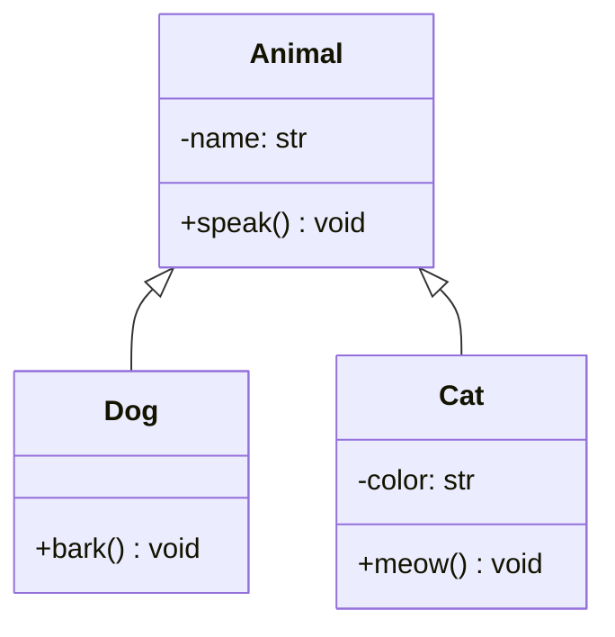
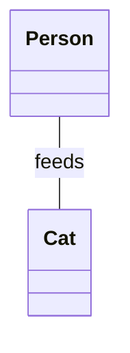
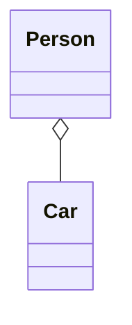
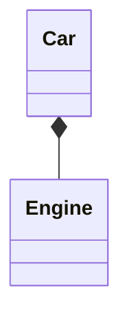

# Overview

In this lesson, we will apply what we've learned about the four pillars of object-oriented programming (OOP) to simple examples in Python. We will create classes and objects, and use inheritance, encapsulation, abstraction, and polymorphism to model simple problems.

This lesson is designed to support the slide material presented on Blackboard.

## Revision

To help you with KBA part 2, here is some quick revision from last term:

- **Sequence**: In our context, refers to the order in which statements are executed in a program. A sequence usually means statements are executed one after the other. Do not confuse this with the `list` data type in Python.

- **Selection**: Refers to the ability to choose between two or more paths in a program. This is usually done using an `if` statement.

- **Iteration**: Refers to the ability to repeat a block of code multiple times. This is usually done using a `for` or `while` loop.

## Reflect

Before we begin, write down a simple single-sentence definition of each of the four pillars:

- Inheritance:
  > Your answer here
- Encapsulation:
  > Your answer here
- Abstraction:
  > Your answer here
- Polymorphism:
  > Your answer here

## Inheritance

Inheritance is a way to form new classes using classes that have already been defined. The newly formed classes are called derived classes, the classes that we derive from are called base classes. The purported benefits of inheritance are code reuse and reduction of complexity of a program. The derived classes (descendants) override or extend the functionality of base classes (ancestors).

```python

class Animal:
    pass

class Cat(Animal):
    pass

```

In this example, `Cat` is a derived class inherited from the base class `Animal`. The `Cat` class will inherit all the attributes and methods of the `Animal` class (currently, there aren't any).

Before we go into the mechanics of subclassing and overriding, we must understand what we have said. By saying that `Cat` inherits from `Animal`, we are saying that `Cat` **is a** `Animal`. Specifically, any cat we instantiate is **both** a `Cat` and an `Animal`. All cats are animals, but not all animals are cats. This is the essence of inheritance.

### Inheriting methods and attributes

Whatever methods are defined in the base class will be available to the derived class.

For example:

```python
class Animal:
    def __init__(self, name):
        self.name = name

    def speak(self):
        print(f"{self.name} speaks")

class Cat(Animal):
    def purr(self):
        print(f"{self.name} purrs")

# Any cat must have a name and can speak and purr!

cat = Cat('Whiskers')
cat.speak() # speaks
cat.purr() # purrs
```

Semantically, we are saying, "all animals must have a name and can speak. Only cats can purr."

### Overriding methods

Whenever we define an attribute or method in a derived class that is already defined in the base class, those methods or attributes are overridden. That is, the derived class will use its own implementation of the method or attribute and no longer inherit the base class's implementation. In Python, this is all or nothing.

For example:

```python
class Dog(Animal):
    ...


class Cat(Animal):
    def speak(self):
        print(f"{self.name} meows")

cat = Cat('Whiskers')
dog = Dog('Rover')

cat.speak() # meows
dog.speak() # speaks
```

Sometimes we want to combine the functionality of the base class with the derived class. We can do this by calling the base class's method from the derived class's method. This is done using the `super()` function.

The most common use of `super()` is in the `__init__` method of a derived class. This is because we often want to initialize the base class's attributes before initializing the derived class's attributes.

For example:

```python
class Cat(Animal):
    def __init__(self, name, color):
        super().__init__(name)
        self.color = color

cat = Cat('Whiskers', 'black')
cat.speak() # speaks

```

Notice that all animals must have a name, but only cats have a color. Try the above without calling super and note any differences!

### More advanced topics

The following section is optional and not required for completion of the course.

#### Inheritance from `object`

In Python, classes that don't inherit from any other class are implicitly derived from the `object` **class**. This is because all classes in Python are objects (more precisely all objects in Python are of type object). The `object` class is the base class for all classes in Python. And it is the reason why even an empty class has 'stuff' - attributes and methods.

In older versions of Python, we had to explicitly inherit from `object`:

```python
# Don't do this:

class Animal(object):
    pass

# In modern python, is **exactly** equivalent to:

class Animal:
    pass
```

It is no longer necessary and undesirable to write classes this way (though it is still possible).

#### `is-a` vs `has-a`

Inheritance used to be synonymous with OOP. But in modern software development practices it is now considered a last resort. This is because inheritance is a very strong relationship. Another term for it is 'coupling' - anything we do to the base class will affect every derived class and every class that derives from those class and so on. This can lead to a lot of unintended consequences.

In modern software development, we prefer composition over inheritance. Composition is a `has-a` relationship. That is, instead of saying a class 'is-a' another type, we try and form relationships that a class 'has-a' another type. This is a much looser relationship and is more flexible but still allows for reuse and code organization.

Composition involves passing (or instantiating) an instance of one class to/in another class.

Raf's golden rule: "if a relationship can be described as `has-a` use composition." Raf's corollary: "almost all relationships _can_ be described as `has-a`.". Finally, if you are sure that inheritance can actually help organize your solution, inherit from an abstract class or interface (that's coming up).

**Consider**: suppose all animals have a tail and can speak. We want to make sure that cats receive these properties, but we don't want to inherit from the `Animal` class. How could we do it using composition?

### Terminology note

In OOP there are many terms to refer to the action of inheriting from a class.

A class that inherits another class, will variously be referred to as any of the following:

- Derived class
- Subclass
- Child/descendent class
- Extended class
- Specialized class

The class that is inherited from will variously be referred to as any of the following:

- Base class
- Superclass
- Parent/ancestor class
- Generalized class

For our purposes, we can think of these terms as being interchangeable. Though, in some contexts, one term may be more appropriate than another.

## Encapsulation

Encapsulation is about setting some boundaries. It is the practice of keeping the internal state of an object private and only exposing a public interface. This is done by using access modifiers (private v. public).

In Python, there is no strict _privacy_ as there are in some other languages.

Instead, we indicate the **intended** privacy of an attribute or method by using a single underscore `_` or double underscore `__` prefix. While this is largely a convention, it does have some practical implications (discussed in the advanced section).

Lots of texts will give various explanation for `_` versus `__` but we will always use a `_` underscore and "just because" is good enough answer.

### Private methods/attributes

When a method or attribute starts with an underscore (`_`) it should only be accessed within the class. It should never be accessed from outside the class. Notice _should_ there is no enforcement in python, but you should follow this convention.

For example:

```python
class Cat:
    def __init__(self, name):
        self._name = name # indicates no one should rename a cat after instantiation

    def meow(self):
        print(f"{self._name} meows") # this is fine.


cat = Cat('Whiskers')

cat._name = 'Rover' # this can be done but shouldn't be done.
```

#### Advanced note

The following is **not** required for completion of the course.

In Python texts, the single versus double underscore is often explained as (a) a convention and (b) implies that the difference between the two is that a single underscore is a "protected" attribute and a double underscore is a "private" attribute; or that a double underscore is "extra" private. This is not true.

##### Myth 1: Underscores are just a convention

In Python, attributes and methods with a single underscore are by default not imported when using `from module import *`. A double underscore is a "name mangling" feature. This means that the attribute is renamed to `_classname__attribute` to avoid name clashes. This is not a privacy feature, but a name collision feature.

##### Myth 2: Use a double underscore when you really want to make something private

Because of name mangling, a double underscore will make inadvertent (or advertent) access to a method or attribute more difficult, but it is not impossible. Moreover, it is a feature designed to avoid overriding a method/attribute in subclasses, but it can make debugging more difficult.

Generally, if this is all sounding too much - that is fine - because the issues around name mangling tend to come up in framework development and are seldom used in day-to-day programming.

## Abstraction

Abstraction is the process of identifying and exposing the essential characteristics of an object while ignoring the irrelevant details.

In practice, it is usually done through inheritance from `abstract` classes or `interfaces`.

An abstract class is a class that cannot be instantiated and is used **only** to define a blueprint for other classes. An interface is a class that contains abstract methods and is used to define a contract for other classes.

In Python, we can use the `abc` module to create abstract classes and interfaces. An ABC (Abstract Base Class) is a mixin - which can be used to define both abstract methods and concrete methods, but an ABC cannot be instantiated.

### Creating an ABC

To create an ABC, we need to import the `ABC` class from the `abc` module and use it as a base class for our abstract class.

```python
from abc import ABC

class Animal(ABC):
    def __init__(self, name):
        self.name = name

    @abstractmethod
    def speak(self):
        pass
```

Try and create an instance of the `Animal` class:

```python
animal = Animal('Rover')
```

What happens?

In the above example, the `Animal` class is an abstract class. It cannot be instantiated, but it can be used as a base class for other classes. The `speak` method is an abstract method, which means that any class that inherits from the `Animal` class must implement the `speak` method.

The `@` symbol is a decorator. Decorators are a way to modify the behavior of functions or methods. In this case, the `@abstractmethod` decorator is used to indicate that the `speak` method is an abstract method.

Try the following and see what happens:

```python
class Dog(Animal):
    def speak(self):
        print(f"{self.name} barks")

class Cat(Animal):
    ...

dog = Dog('Rover')
dog.speak()
cat = Cat('Whiskers')
cat.speak()
```

Make sure you know **when** the code above fails.

## Polymorphism

Polymorphism is the biggest word but not a very hard concept - particularly if you understand inheritance and abstraction.

Poly means many and morph means form. So, polymorphism means many forms. It is the ability to treat many types in a similar way.

We achieve this through inheritance (for example, we can write a function to make an animal speak that will work with both cats and dogs) and through interfaces (for example, we can write a function that will work with any object that has a `speak` method, regardless of type).

### Polymorphism through inheritance

```python
class Dog(Animal):
    def speak(self):
        print("Dog barks")

class Cat(Animal):
    def speak(self):
        print("Cat meows")

def talk_to_an_animal(animal):
    print("Hello, animal!")
    animal.speak()

```

Try removing the inheritance from the `Dog` and `Cat` classes and see what happens.

## Relationships between objects

In object-oriented programming, objects can have relationships with other objects. There are several types of relationships, including:

- Inheritance
- Association
- Aggregation
- Composition

Inheritance, we already discussed. Association is just another term for "some relationship" - it is the most general term for a relationship between objects.

Aggregation and composition are more specific types of relationships.

### Aggregation and composition

When discussing object-oriented programming, we often talk about relationships between objects. Two common types of relationships are aggregation and composition.

These two are often confused, but the difference is significant, if subtle.

#### Aggregation

Refers to an object having a reference to another object (or objects). The objects are independent of each other, and the child object can exist without the parent object.

Examples of aggregation include a `Person` object having a `Car` object, or a `Library` object having a `Book` object; a classroom object having student objects. Cars, books, and students can all exist independently of their 'container` and can be interchanged between containers.

#### Composition

Also involves an object having a reference to another object (or objects). However, the objects are dependent on each other, and the child object cannot exist without the parent object.

Examples of composition include a `Person` object having a `Heart` object, or a `Car` object having an `Engine` object. A `Heart` cannot exist without a `Person`, and an `Engine` cannot exist without a `Car`.

## UML Class Diagrams (optional)

In the past, this was a mandatory part of the course, but it is now optional. Nevertheless, you will frequently see object-oriented design expressed in UML, so it is worth having some basic familiarity with this notation.

### Inheritance relationship

An inheritance relationship can be expressed as a solid line with a hollow arrowhead pointing to the superclass.

For example:



### Association relationship

An association relationship can be expressed as a solid line between two classes. It is often annotated with a label to indicate the nature of the relationship.

For example:



### Aggregation relationship

An aggregation relationship can be expressed as a solid line with a hollow diamond at the parent class.

For example:



### Composition relationship

A composition relationship can be expressed as a solid line with a solid diamond at the parent class.

For example:



## Exercises

1. Create a class `Shape` with an abstract method `area`. Create two subclasses `Circle` and `Rectangle` that inherit from `Shape`. Implement the `area` method for each subclass.

2. Create a `BankAccount` class with private attributes for `account_number` and `balance`. Implement methods to `deposit`, `withdraw`, and view the current `balance`.

3. Complete the KBA exercises.

### Advanced exercises

These exercises are not mandatory.

1. Implement a payment system where a base class `Payment` has a method `authorize_transaction()`. Create different payment method classes like `CreditCardPayment`, `DebitCardPayment`, and `PayPalPayment`, each implementing the authorization method differently (that can just be a print statement for now).
   1. Demonstrate that you can authorize transactions without any knowledge of the specific payment method.
   2. What would be the benefits of implementing `authorize_transaction` as an abstract method in the `Payment` class?
