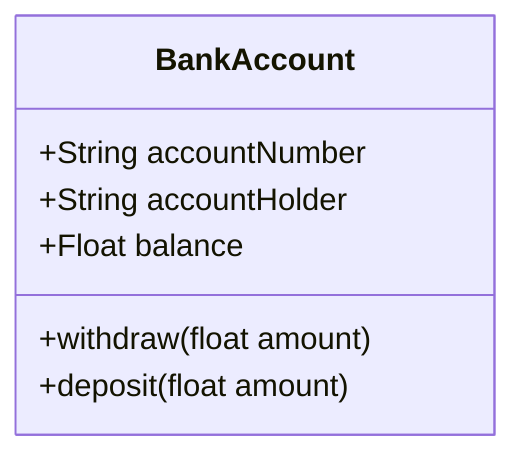

# Revision from week 11

## Revision questions

Answer the following questions:

1. What is the main point of OOP in Python?
2. What is the difference between a class object and an instance object?
3. Why is the first argument in a class’s method function special?
4. What is the __init__ method used for?
5. How do you create a class instance?
6. How do you create a class?

 > Questions taken from the following reference (includes answers):

[Link](https://learning.oreilly.com/library/view/learning-python-6th/9781098171292/ch26.html)

## Considerations

- Ensure you implement using PEP8
- Use the appropriate file naming conventions
- Use if/name/main to "drive" your definitions

## Create a class

Create a class with the following attributes and behaviors (methods):

The business requirements are:

- All accounts must have an account number on creation.
- Bank accounts always start with a balance of 0.

## Create instances

Do the following in a main function:

- Create two instances of the bank account class
- Deposit 1000 into the first account
- Deposit 500 into the second account
- Withdraw 200 from the first account
- Print the balance of both accounts

