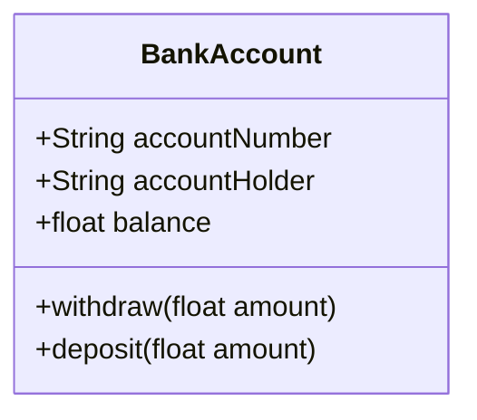

# Revision from week 11

## Considerations

- Ensure you implement using PEP8
- Use the appropriate file naming conventions
- Use if/name/main to "drive" your definitions

## Create a class

Create a class with the following attributes and behaviors (methods):

The business requirements are:

- All accounts must have an account number on creation.
- Bank accounts always start with a balance of 0.

## Create instances

Do the following in a main function:

- Create two instances of the bank account class
- Deposit 1000 into the first account
- Deposit 500 into the second account
- Withdraw 200 from the first account
- Print the balance of both accounts

