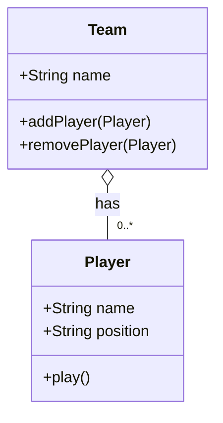

# Aggregation

An aggregation relationship in OOP, is a relationship where one object contains another object.

The containership is a "has-a" relationship, rather than an "is-a" relationship (inheritance). The aggregated object is a separate entity though. That is, it may be created or destroyed independently of the containing object, or it may move from one containing object to another.

In UML, an aggregation relationship is represented by an unfilled diamond shape pointing to the containing object.

## UML Example

> Ensure you have configured PyCharm to use the `mermaid` extension for class diagrams.



**Notice:**

- Cardinality `0..*`: A team can have zero or more players.
- Lifecycle: The players can exist independently of the team.
- A team must contain a reference to the players. This attribute is typically a collection such as a list and is implied by the aggregation symbol.

## Python Implementation

```python
# player.py
class Player:
    ...
```

```python
# team.py
class Team:
    ...
```

```python
# main.py
from player import Player
from team import Team

...
```
