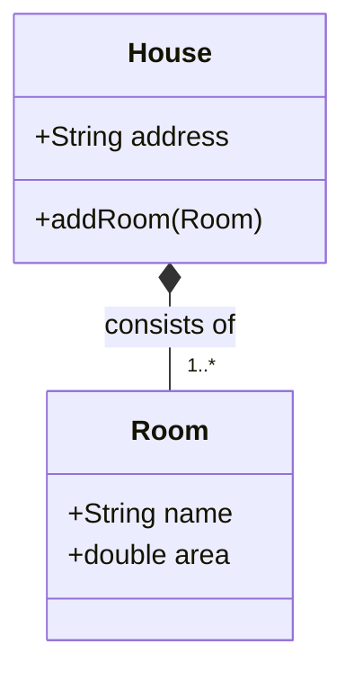

# Composition

A composition relationship is a type of aggregation where the contained object cannot exist independently of the containing object. In other words, the contained object is dependent on the containing object and will be destroyed when the containing object is destroyed.

In UML, a composition relationship is represented by a filled diamond shape pointing to the containing object.

## UML Example



## Python Implementation

```python
# room.py
class Room:
    def __init__(self, name, area):
        self.name = name
        self.area = area

# house.py
from room import Room
class House:
    def __init__(self, address):
        self.address = address
        self.rooms = []

    def add_room(self, name, area):
        room = Room(name, area)
        self.rooms.append(room)


# main.py
from house import House
house = House("456 Elm St")
house.add_room("Living Room", 30.0)
house.add_room("Kitchen", 15.0)
house.add_room("Bedroom", 20.0)
```
