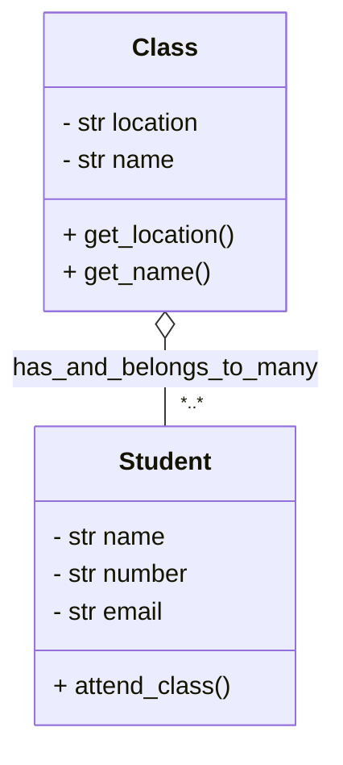
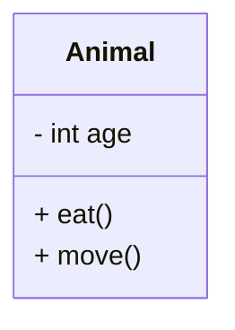
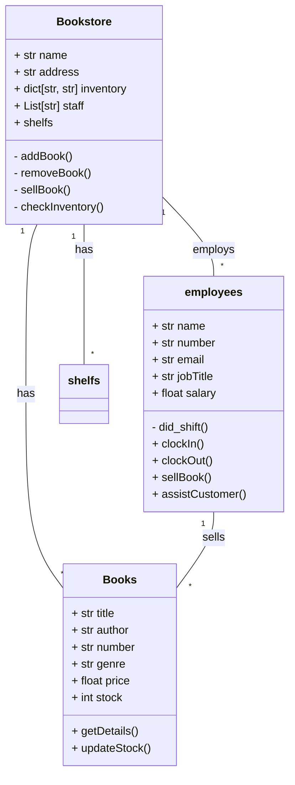
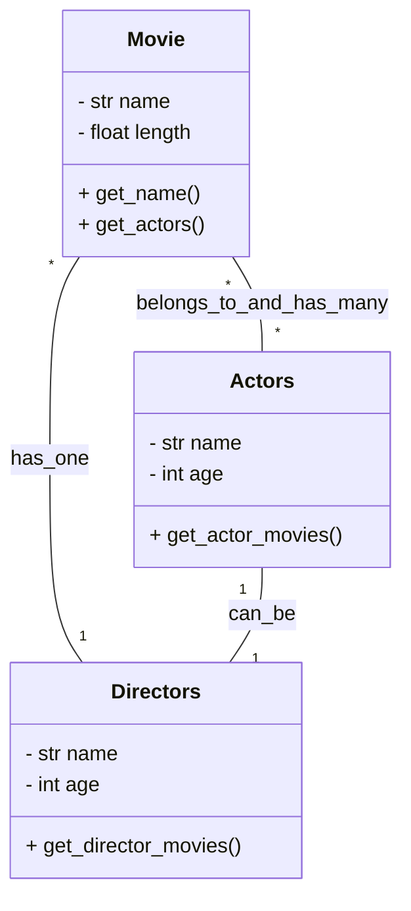

# Heading 1
## Heading 2
Some content?
## Another heading 2
Some more content

```python
def some_function():
  return "wow!"
```

```javascript
  const someFunction = () => {
    return "hello";
  }
```









