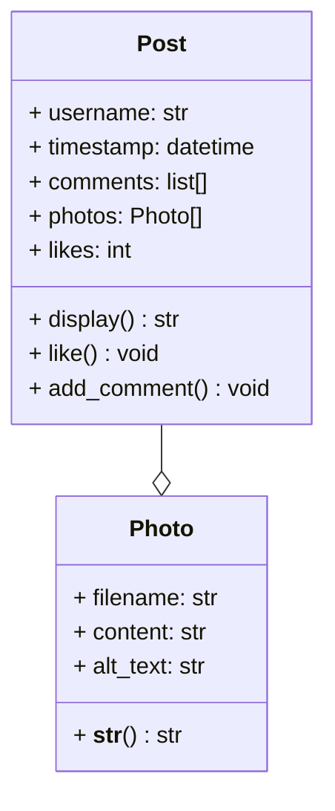

Hey look, it's the last social media posts example from Week 12!

We're going to use it as a starting point.

```mermaid
classDiagram
    Post --o Photo

    class Post {
        + username: str
        + timestamp: datetime
        + display() str
        + comments: list[]
        + photos: Photo[]
        + likes: int
        + like() void
        + add_comment() void
    }

    class Photo {
        + filename: str
        + content: str
        + alt_text: str
        + __str__() str
    }
```