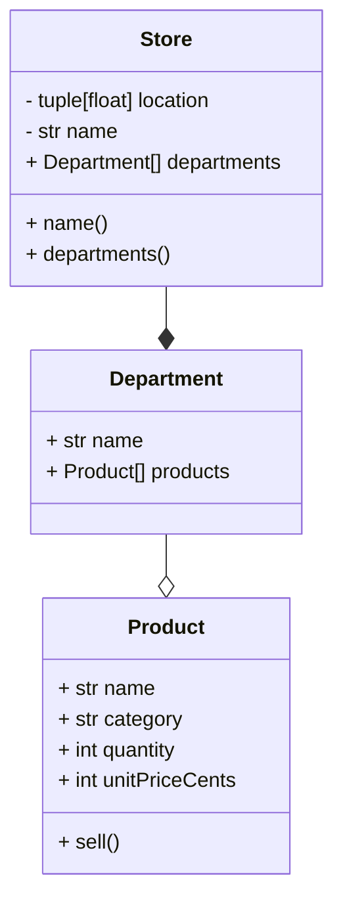

Viewing this in VS Code?

0. You will need a mermaid extension -- check for Matt Bierner's "Markdown Preview Mermaid Support"
1. ctrl + shift + p OR command + shift + p
2. Type: > Markdown: open preview to side
3. View this file, but rendered nicely

If you did it correctly, this preformatted block will be a diagram:

