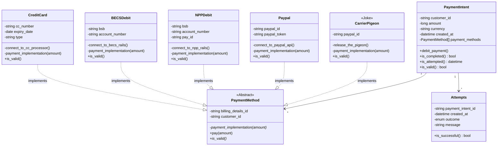

# OOP Examples

Here are some OOP examples written in Python.

A lot of OOP examples are a little more whimsical, or 'toy-ish'.

It's quite common to see something like this, when you're starting out in OOP.

That's fine, and it gets the idea across, but maybe it's nice to see something a bit more grounded in the reality of what you might be programming.  After all, unless you're making a life simulator or a video game, there's probably not a lot of reason to design classes like these.

# Payments Processor
This project, in the subfolder `payments_processor`, is a self-contained Python CLI-based program.  It doesn't do much.  It brings up a toy payments processor.

The idea here is that we're looking at a small subset of the functions of a payments processor, encapsulated in an OOP way.

The only thing that this program is supposed to do is to capture *inbound* payments from customers (to "your business").

"Your business" doesn't really care how the payment is made to you, only that it is made.  For all you care, the customer may be sending you your payment by carrier pigeon.

> [!Important Note]
>
> You cannot actually just store payment details in reality without a lot of work! 
> We often rely on third party payment processors to handle this data storage for us, because it's very dangerous to store this kind of customer information.
> But this is a toy, so we can pretend.

